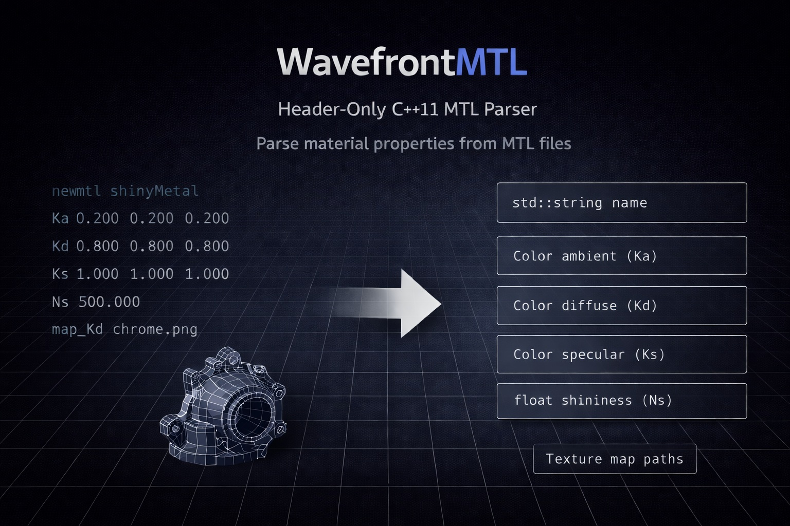

# WavefrontMTL


Wavefront MTL Parser - C++ 11 Class for Parsing Material Information

A header-only C++ wavefront material parser is a self-contained software component that can be included in C++ projects and is designed to parse and extract material properties from Wavefront Material Template Library (MTL) files. The parser operates solely on the material-related data in the MTL files, allowing for easy integration into C++ projects without the need for external dependencies. It can interpret and extract properties such as ambient color, diffuse color, specular color, shininess, transparency, and texture maps defined in the MTL file. The extracted material properties can be used to render realistic 3D objects in computer graphics applications.

### Key Features

- Supports parsing of standard MTL parameters
- Supports parsing of Clara.io MTL parameters
- Supports parsing of DirectXMesh MTL parameters
- Retrieves header information and all materials in the MTL file
- Provides convenient access to material properties
- Robust and efficient parsing algorithm for handling large MTL files
- Suitable for integration into 3D graphics applications, game engines,
  and other computer graphics projects

### Compatibility and Dependencies
- C++ 11 Standard
- Standard Template Library (STL)

This project is designed to be compatible with C++11 and utilizes solely standard C++ Standard Template Library (STL) components. It has been thoughtfully engineered to function independently without the need for any supplementary external libraries or dependencies. This streamlined design ensures the project remains self-contained, promoting simplicity and ease of integration into your development environment.<br>

*If you require the use of **C++98**, see [Wavefront98](https://github.com/StefanJohnsen/Wavefront98) repository.

### Need a Wavefront Object File (OBJ) parser?
*When working with Wavefront Material Template Library (MTL) files, you need a reliable Wavefront OBJ parser to handle the corresponding geometry data.
WavefrontMTL is designed to complement and work seamlessly with the [WavefrontOBJ](https://github.com/StefanJohnsen/WavefrontOBJ) repository.*

### OS Support
- Windows
- Linux
- macOS
 
### Usage

Copy `WavefrontMTL.h` to your project and include the file.

```
#include "WavefrontMTL.h"
```

## Material Class

After parsing the material file, you will be presented with a comprehensive list of all the materials discovered in the file. Each material is encapsulated within a structure and contains the following member variables.

| Member        | Type          | Description                  | Extension                              |
|---------------|---------------|------------------------------|----------------------------------------|
| name          | string        | Material name                |                                        |
| Kd            | Color         | Color                        |                                        |
| Ka            | Color         | Color Ambient                |                                        |
| Ks            | Color         | Color Specular               |                                        |
| Tf            | Color         | Color Transmission           |                                        |
| Ns            | double        | Shininess factor [0..1000]   |                                        |
| map_Kd        | Texture       | Texture Diffuse              |                                        |
| map_Ka        | Texture       | Texture Ambient              |                                        |
| map_Ks        | Texture       | Texture Specular             |                                        |
| map_Ns        | Texture       | Texture Glossiness           |                                        |
| map_Pr        | Texture       | Texture Roughness            |                                        |
| map_Pm        | Texture       | Texture Metalness            |                                        |
| map_Ps        | Texture       | Texture Sheen                |                                        |
| map_d         | Texture       | Opacity Texture (alpha)      |                                        |
| map_bump      | Texture       | Normal texture               |                                        |
| map_Po        | Texture       | Texture Occlusion            |                                        |
| sharpness     | double        | Sharpness value [0..1000]    |                                        |
| d             | Opacity       | Dissolve factor              |                                        |
| disp          | Texture       | Displacement map             |                                        |
| decal         | Texture       | Stencil decal                |                                        |
| bump          | Texture       | Normal texture               |                                        |
| illum         | int           | Illumination [0..10]         |                                        |
| Ni            | double        | Optical density              |                                        |
| Tr            | double        | Transparency                 |                                        |
| refl          | Reflection    | Reflection map               |                                        |
| Ke            | Color         | Color Emissive               | Physically Rendering/Clara.io          |
| Pr            | double        | Roughness factor             | Physically Rendering/Clara.io          |
| Pm            | double        | Metalness factor             | Physically Rendering/Clara.io          |
| Ps            | double        | Sheen factor                 | Physically Rendering/Clara.io          |
| Pc            | double        | Thickness factor             | Physically Rendering/Clara.io          |
| Pcr           | double        | Roughness factor             | Physically Rendering/Clara.io          |
| aniso         | double        | Anisotropy                   | Physically Rendering/Clara.io          |
| anisor        | double        | Anisotropy rotation          | Physically Rendering/Clara.io          |
| map_Ke        | Texture       | Texture Emissive             | Physically Rendering/Clara.io          |
| norm          | Texture       | Texture Normal               | Physically Rendering/Clara.io          |
| map_RMA       | Texture       | Texture RMA                  | DirectXMesh/Microsoft's DirectX engine |
| map_ORM       | Texture       | Texture ORM                  | DirectXMesh/Microsoft's DirectX engine |


## example.mtl

```
# Example of a material file that will be used in the subsequent examples

newmtl mat_1
Ka 0.328013 0.328013 0.328013
Kd 0.627451 0.627451 0.627451
Ns 750.000000

newmtl mat_2
Ka 0.031400 0.031400 0.031400
Kd 0.098039 0.098039 0.098039
Ks 0.977692 0.968577 0.945277
```
Let's consider a scenario where our 3D graphics application is required to extract the values of Kd, Ka, and Ks for all materials from the material file. If these values are not present in the file, we will implement our default values, such as blue, as the default color.
This system has three possible approaches to achieve this, as demonstrated below.

### Method 1

A classic approach to checking values is to load the file, iterate over all the materials, and retrieve the desired values. The "isParsed()" function can be used to check if the value has been read, and it returns true if the value is parsed.

```cpp
#include "WavefrontMTL.h"
#include <iostream>

int main()
{
	mtl::Load file;

	if( !file.load("C:\\temp\\example.mtl") )
		return 1;

	mtl::Color K;

	K.color = mtl::rgb(0, 0, 1); //Blue

	//Loop over all materials and check Ka, Kd and Ks

	for( auto& material : file.materials() )
	{
		if( !material.Ka.isParsed() )
			material.Ka = K;

		if( !material.Kd.isParsed() )
			material.Kd = K;

		if( !material.Ks.isParsed() )
			material.Ks = K;
	}

	//Trace out data
	for (auto& material : file.materials())
	{
		std::string name = material.name;

		std::cout << "newmtl " << name << std::endl;

		std::cout << "Ka " << " " << material.Ka.color.r << " " << material.Ka.color.g << " " << material.Ka.color.b << std::endl;
		std::cout << "Kd " << " " << material.Kd.color.r << " " << material.Kd.color.g << " " << material.Kd.color.b << std::endl;
		std::cout << "Ks " << " " << material.Ks.color.r << " " << material.Ks.color.g << " " << material.Ks.color.b << std::endl;

		std::cout << std::endl;
	}

	return 0;
}
```
By running this code, we get
```
newmtl mat_1
Ka  0.328013 0.328013 0.328013
Kd  0.627451 0.627451 0.627451
Ks  0 0 1

newmtl mat_2
Ka  0.0314 0.0314 0.0314
Kd  0.098039 0.098039 0.098039
Ks  0.977692 0.968577 0.945277
```

### Method 2

This approach is the preferred method, as it allows pre-defined default values to be used if a value is not found.

```cpp
#include "WavefrontMTL.h"
#include <iostream>

int main()
{
	mtl::Material defaultValues;

	defaultValues.Ka.color = mtl::rgb(0, 0, 1);
	defaultValues.Kd.color = mtl::rgb(0, 0, 1);
	defaultValues.Ks.color = mtl::rgb(0, 0, 1);

	mtl::Load file(defaultValues);

	if( !file.load("C:\\example.mtl") )
		return 1;

	for( auto& material : file.materials() )
	{
		std::string name = material.name;

		std::cout << "newmtl " << name << std::endl;

		std::cout << "Ka " << " " << material.Ka.color.r << " " << material.Ka.color.g << " " << material.Ka.color.b << std::endl;
		std::cout << "Kd " << " " << material.Kd.color.r << " " << material.Kd.color.g << " " << material.Kd.color.b << std::endl;
		std::cout << "Ks " << " " << material.Ks.color.r << " " << material.Ks.color.g << " " << material.Ks.color.b << std::endl;

		std::cout << std::endl;
	}

	return 0;
}
```
By running this code, we get the same result as Method 1. The value for Ks is not defined for material_1 in the file, and as per the default settings, Ks has been assigned the value "blue".

```
newmtl mat_1
Ka  0.328013 0.328013 0.328013
Kd  0.627451 0.627451 0.627451
Ks  0 0 1

newmtl mat_2
Ka  0.0314 0.0314 0.0314
Kd  0.098039 0.098039 0.098039
Ks  0.977692 0.968577 0.945277
```

### Method 3

This approach utilizes a material file as a source for default values, which can be defined as desired. The material file follows the same rules and format as a standard MTL file. Let's create a basic file for demonstration. 

```
# My default values
newmtl blue
Ka 0 0 1
Kd 0 0 1
Ks 0 0 1 
newmtl red
Ka 1 0 0
Kd 1 0 0
Ks 1 0 0 
```

```cpp
#include "WavefrontMTL.h"
#include <iostream>

int main()
{
	mtl::Load defaultFile;

	if( !defaultFile.load("C:\\default.mtl") )
		return 1;

	mtl::Material defaultValues;

	if( !defaultFile.lookup("blue", defaultValues) )
		return 1;

	mtl::Load file(defaultValues);

	if( !file.load("C:\\example.mtl") )
		return 1;

	for( auto& material : file.materials() )
	{
		std::string name = material.name;

		std::cout << "newmtl " << name << std::endl;

		std::cout << "Ka " << " " << material.Ka.color.r << " " << material.Ka.color.g << " " << material.Ka.color.b << std::endl;
		std::cout << "Kd " << " " << material.Kd.color.r << " " << material.Kd.color.g << " " << material.Kd.color.b << std::endl;
		std::cout << "Ks " << " " << material.Ks.color.r << " " << material.Ks.color.g << " " << material.Ks.color.b << std::endl;

		std::cout << std::endl;
	}

	return 0;
}
```

By running this code, we get the same result. 

```
newmtl mat_1
Ka  0.328013 0.328013 0.328013
Kd  0.627451 0.627451 0.627451
Ks  0 0 1

newmtl mat_2
Ka  0.0314 0.0314 0.0314
Kd  0.098039 0.098039 0.098039
Ks  0.977692 0.968577 0.945277
```

One of the advantages of this approach is that there is no need for additional programming. If you wish to modify default values, you can update the default.mtl file.

## Test Wavefront MTL
We have included a trace routine called TraceMTL, which simplifies verifying the data that WavefrontMTL reads from any given MTL file. Let's examine a complex example and utilize TraceMTL to illustrate the data successfully parsed from it.

Below is a material file containing advanced use of MTL with only one material.

```
# Example of advance use of MTL
newmtl advance
Ka 0.0435 0.0435 0.0435
Kd 0.1086 0.1086 0.1086
Ks 0.0000 0.0000 0.0000
Tf 0.9885 0.9885 0.9885
illum 6
d -halo 0.6600
Ns 10.0000
sharpness 60
Ni 1.19713
map_Ka -s 1 1 1 -o 0 0 0 -mm 0 1 chrome.mpc
map_Kd -s 1 1 1 -o 0 0 0 -mm 0 1 chrome.mpc
map_Ks -s 1 1 1 -o 0 0 0 -mm 0 1 chrome.mpc
map_Ns -s 1 1 1 -o 0 0 0 -mm 0 1 wisp.mps
map_d -s 1 1 1 -o 0 0 0 -mm 0 1 wisp.mps
disp -s 1 1 .5 wisp.mps
decal -s 1 1 1 -o 0 0 0 -mm 0 1 sand.mps
bump -s 1 1 1 -o 0 0 0 -bm 1 sand.mpb
refl -type sphere -mm 0 1 clouds.mpc
```

Let's parse this file and utilize the trace functionality to showcase the data collected by WavefrontMTL.

```cpp
#include "WavefrontMTL.h"
#include "TraceMTL.h"

int main()
{
	mtl::Load file;

	if( !file.load("C:\\advance.mtl") )
		return 1;

	mtl::trace(file);

	return 0;
}
```

Upon running this process, we obtain...

```
 Example of advanced use of MTL

 newmtl advance
 Ka 0.0435 0.0435 0.0435
 Kd 0.1086 0.1086 0.1086
 Ks 0 0 0
 map_Kd -mm 0 1 -o 0 0 0 -s 1 1 1 chrome.mpc
 map_Ka -mm 0 1 -o 0 0 0 -s 1 1 1 chrome.mpc
 map_Ks -mm 0 1 -o 0 0 0 -s 1 1 1 chrome.mpc
 map_Ns -mm 0 1 -o 0 0 0 -s 1 1 1 wisp.mps
 map_d -mm 0 1 -o 0 0 0 -s 1 1 1 wisp.mps
 Ns 10
 Tf 0.9885 0.9885 0.9885
 sharpness 60
 d -halo 0.66
 disp -s 1 1 0.5 wisp.mps
 decal -mm 0 1 -o 0 0 0 -s 1 1 1 sand.mps
 bump -bm 1 -o 0 0 0 -s 1 1 1 sand.mpb
 illum 6
 Ni 1.19713
 refl -type sphere -mm 0 1 clouds.mpc
```

## References
The following sources have been utilized in the development of this Wavefront MTL parser.

[Paul Bourke: MTL material format (Lightwave, OBJ)](http://paulbourke.net/dataformats/mtl/)

[Wikipedia: Wavefront .obj file](https://en.wikipedia.org/wiki/Wavefront_.obj_file)

[FileFormat.info: WaveFront Material (.mtl) File Format](https://www.fileformat.info/format/material/)

## License
This software is released under the GNU General Public License v3.0 terms.<br> 
Details and terms of this license can be found at: https://www.gnu.org/licenses/gpl-3.0.html<br><br>
For those who require the freedom to operate without the constraints of the GPL,<br>
a commercial license can be obtained by contacting the author at stefan.johnsen@outlook.com
